# Hermes 分层协作与 Codex 监督插件：首版规格

状态：2026-10-07 已确认定稿，可交接实现；本文件描述待实现行为，未安装插件，也未执行真实接口验收。

目标：[Hermes 分层协作与 Codex 监督插件决策地图](https://github.com/Ghost233/GhostHermesProjectManagerPlugins/issues/1)。定稿工单：[锁定首版插件规格、管理入口与验收边界](https://github.com/Ghost233/GhostHermesProjectManagerPlugins/issues/9)。

## 1. 首版范围与实现方案

本规格将已确认的角色、公开交接、会话控制、监督通知和资料边界收敛为以下实现方案。

| 项目 | 已确认首版方案 |
| --- | --- |
| 管理入口 | 飞书聊天管理与 Hermes Web Dashboard 查看、配置及生命周期操作，共用状态和权限检查 |
| 运行拓扑 | Hermes、管理实例和 Codex 执行端在同一主机；首版不配置跨主机执行端 |
| 档案保留 | 登记的迁移旧档案与封存 Profile 的记忆、历史永久保留，删除须本人明确提出 |
| 持久化 | 一个管理实例，使用独立 SQLite 存储全局目录、队列和关联凭据；各 Profile 保留自己的记忆及原生存储 |
| 备份 | 迁移、升级、恢复前建立一致性检查点；对发生变化的受保护数据每日建立快照，保留最近 7 个每日快照，迁移／升级检查点及至少一个可恢复档案基线长期保留 |
| 升级 | 进入维护模式，等待可核实的交接点后备份和切换；不能安全交接时要求明确处理，不假定支持热升级 |
| 主动停用 | 停止接新任务，请求中断受管执行并核实，保留改动；只观察的手动执行不自动中断 |
| 启用条件 | 配置、身份、实际接口和权限能力验证通过后才启用对应功能；静态研究不视为运行验收 |

永久保留保护原资料及可恢复基线，备份副本轮换不等于删除受保护档案。活动 Profile 的全部原生聊天历史不由本条自动改为永久保留；需作为长期来源的内容必须明确登记保护。

## 2. 产品与责任边界

总管是日常入口，负责全局目录、跨项目派发、汇总及需要本人的问题。项目总负责人拥有自己的 mono，通过 Codex 开发、集成及全局验证，并管理下属。子负责人由本人明确指定，长期绑定具体项目，仅承接明确 GitHub Issue 的开发或测试。

后两层可合并。一个项目的 submodule 数量不决定负责人数量；未指定子负责人的子仓问题仍交本人决定。总负责人只修改自己的仓库内容和子模块引用，不自行 checkout 或修改子仓源码。

责任角色与开发型／非开发型能力分类独立。Wiki 和 Ghost个人助手位于项目树之外，保留通用职责，按需要加入项目群。插件提供调度、资料、监督及管理；Codex 沿用原生环境、仓库规则和 Matt 工作流。

涉及 GitHub 的操作使用 Ghost233；每次需要认证的 gh 业务操作前切换账号并核验实际登录，不符则停止。远程更新后核对相应本地分支及远端完整 hash，只允许 fast-forward 同步，不自动 stash、移动、删除或覆盖用户未提交／未跟踪内容。

规范来源：

- [确定责任角色、项目与 Profile 的归属和生命周期](https://github.com/Ghost233/GhostHermesProjectManagerPlugins/issues/4)：角色主决定及后续父子一起封存、子 Profile 逐个恢复的修订。
- [确定飞书群内公开交接与消息关联协议](https://github.com/Ghost233/GhostHermesProjectManagerPlugins/issues/5#issuecomment-6017769799)。
- [确定 Codex 会话登记、控制与接管规则](https://github.com/Ghost233/GhostHermesProjectManagerPlugins/issues/6#issuecomment-6019876234)。
- [确定监督状态、汇报频率与人工介入闭环](https://github.com/Ghost233/GhostHermesProjectManagerPlugins/issues/7#issuecomment-6020454695)。
- [确定资料查询、上下文传递与记忆回写边界](https://github.com/Ghost233/GhostHermesProjectManagerPlugins/issues/8#issuecomment-6021181667)。

2026-10-07 的 Grill with Docs 补充审阅确认：封存后的档案由总管按登记授权只读代查；交付版本、工作区交接及运行中 Issue 变化按下述契约处理。

## 3. 部署和模块分工

同机方案使用已登记的本地仓库及实际 Codex 服务。原始历史相同不代表执行器相同；独立 app-server 创建的任务不保证自动出现在 Codex 桌面。桌面、共享 daemon、独立 CLI 的接入能力分别验收。

同机约束适用于管理与 Codex 执行端，资料来源沿用已授权的原本连接，可以是本地或外部原资料库；这不增加跨主机 Codex 控制能力。

一个指定管理实例承载全局协调，运行在 Hermes Gateway 的插件后台生命周期中。各新 Profile 加载同一插件，作为已登记参与者调用该实例；不各自维护一份权威全局队列。Dashboard 在自身进程中经本机受控接口访问同一管理实例，离线时只能显示最后已知状态及时间，不能声称操作已执行。

管理实例离线期间不承诺按时通知。恢复后先对账；未确认的执行、请求及占用不因超时自动释放或重启。Dashboard 不能自行变成第二个执行控制器。

| 模块 | 职责和边界 |
| --- | --- |
| 目录与授权 | 管理角色、项目、仓库、机器人、群和来源关系，从已核验入口取得身份；不信任文本自称角色 |
| 请求与消息路由 | 真实 @、每群起始锚、去重、逐级回传和收发凭据；发送成功不代表受理 |
| 任务协调与监督 | 仓库串行、验证占用、控制归属、状态证据、通知计时及重启对账 |
| Codex 适配器 | 连接实际执行服务，执行经授权的启动、追加、中断和有效请求应答；不模拟不存在的接口 |
| 资料与记忆适配器 | 限定来源查询、任务材料、所属 Profile 的精选记忆及迁移档案；不自动写 Wiki 原库 |
| 生命周期与备份 | 生成安装／迁移／升级计划，保护档案，验证停用及恢复条件；不因计划生成就改变运行状态 |

模块均属于统一 Hermes 插件包。打包采用正式 plugin.yaml 与 register(ctx) 入口，同包提供 Dashboard 资源和 plugin_api.py。私有模块名及内部函数不是 Hermes 已有 API。

## 4. 管理入口

| 操作 | 飞书聊天与 Dashboard 的共同规则 |
| --- | --- |
| 新建／登记项目及 Profile | 明确角色、能力、长期项目绑定和已有仓库；新 Profile 使用新机器人，配置未完成不接单 |
| 调整归属 | 总管管理全局，总负责人管理下属；跨总负责人移交由总管处理，保留项目绑定与记忆 |
| 派发任务 | 子负责人必须关联明确 Issue；确认目标、范围及仓库后入队，受理与实际执行分别反馈 |
| 观察／接管／归还 | 手动默认只观察；接管限本次工作，归还不打断正在执行的任务 |
| 追加／停止／继续 | 关联原会话；核实停止后外层任务结束、保留改动；明确继续按当前队列安排 |
| 回答／审批 | 唯一关联有效请求并核对身份、授权与控制；审批须明确决定，普通继续不当批准 |
| 封存／恢复 | mono 与下属一起封存；恢复只恢复总负责人，下属逐个恢复，旧执行不自动续跑 |
| 来源／偏好管理 | 来源范围内查询无需逐次批准；额外来源、原始资料访问及新偏好按本人明确范围登记 |
| 封存档案查询 | 公开 @ 总管，由总管按本人登记的档案来源及公开共享范围只读代查，回传相关结论与来源，不恢复旧入口或执行 |
| 维护／备份／恢复 | 展示具体计划、范围、现有执行及检查点；缺少条件时说明未完成，不静默执行替代动作 |

所有入口调用相同操作校验。Dashboard 的请求体不能通过声明 actor 或 role 提升权限。总管／负责人机器人按既定职责协作，不能代作本人的新决定、审批或资料授权。

Dashboard 首版提供四类页面：

1. 组织概览：角色与能力、项目关系、生命周期、机器人与群绑定、队列和最近核实时间。
2. 任务详情：执行／交付／PR 状态、原会话与控制归属、证据、待答问题、关联群消息和下一步。
3. 配置：登记与绑定、通知参数、资料来源范围和非敏感连接引用；修改先显示变更和生效条件。
4. 生命周期与健康：配置中事项、维护计划、档案／备份、兼容能力及受阻原因。

新飞书应用开通、必要凭据录入、缺少权限的入群及原界面敏感输入保留人工步骤。界面显示待完成事项及定位，不要求在群内提交凭据。

## 5. 最少配置

以下是插件自己的配置契约示例，不是可直接安装的 Hermes manifest。所有示例名称及路径是占位值；实际配置必须经登记验证。

~~~yaml
schema_version: 1
manager_profile: ghost-steward
state_dir: <coordinator-data-dir>
execution_topology: local_only
owner_identity_ref: owner-ghost
github_account: Ghost233
notifications:
  summary_seconds: 900
  stall_check_seconds: 900
  disconnect_alert_seconds: 120
  blocking_reminder_seconds: 1800
archives:
  protected_retention: permanent
  daily_snapshot_keep: 7
  checkpoint_retention: permanent
~~~

目录、仓库、会话和来源对象经同一管理接口登记。文件导入是显式配置操作，不因扫描到新目录或文件变更就自动创建 Profile、接管会话或启用执行。配置变更保存版本、适用范围及处理结果。

凭据保留在原生配置／凭据管理位置，插件保存引用。不得整包复制旧 .env、机器人绑定、工具／模型配置或外部 memory bank 来冒充选择性迁移。

必要校验：

- 组织采用已定三层或合并方式；独立助手不被强制放入项目树，子负责人不因 submodule 自动生成。
- 项目 Profile 的长期绑定不可直接改成另一个项目；新项目新 Profile，恢复原项目沿用原绑定。
- 仓库必须真实存在，识别规范路径、Git 公共目录、所有嵌套子仓和测试产物范围；不同路径不能借机绕过同一逻辑仓库的外层串行。
- 原生 profile.yaml.role 不写入自定义组织角色；组织角色属于插件目录。
- 机器人及本人身份按实际应用／租户范围核验，不凭显示名称或跨应用 open_id 相等判断。
- 首版同机范围不接受远程执行端配置；以后扩大为跨主机时，须修订配置、连接、权限和恢复验收。

## 6. 持久化与恢复对象

SQLite 位于管理实例专有目录，承担事务、唯一受理及队列／占用。Hermes 的 Profile-scoped ctx.state 只用于本 Profile 的缓存或引用，不承担全局事务。原资料库、原生记忆与聊天档案仍由各自原存储保管；受保护快照单独保存。

| 逻辑对象 | 至少保存的内容 |
| --- | --- |
| Profile／Project | 稳定标识、原生 Profile 引用、责任角色、能力分类、项目与上级关系、生命周期及配置版本 |
| RepoBinding | 逻辑仓库、归属项目、现有工作区、Git 元数据范围、嵌套只读边界、允许测试产物位置及准备动作 |
| Task／SessionBinding | 已受理目标及验收范围、可核实的 Issue 版本／更新定位、来源请求、负责人、队列及交付状态；实际服务、thread／session／turn、控制模式、授权范围和明确停止意图 |
| Request／MessageAnchor | 请求类型与目标、每群消息锚、受理与发送状态、去重键；人工请求的原服务及请求对应关系、有效性与处理结果 |
| Queue／ValidationRun | 仓库占用归属、本次子交付清单、实际版本组合、准备／验证状态、待核对条件与本轮结束原因 |
| SourceGrant／MemoryIndex | 来源、允许查询主体与公开共享范围、迁移关系、材料版本／定位、精选事实的归属及验证来源、偏好适用范围；总管的档案代查授权单独登记 |
| Archive／BackupManifest | 受保护来源、原存储及快照定位、完整性、格式／版本、保留与恢复验证结果 |
| Evidence／DeliveryLedger | 交付源码的固定提交与逻辑仓库、工作区及 Issue／PR 定位，必要测试／同步证据、操作和消息处理凭据、通知时间；不保存无关输出或秘密 |

这是逻辑契约，不强制每个对象对应独立物理表。任务、请求和消息关联不能只存于内存。启动时先恢复目录与明确意图，再对账实际服务；数据库不可用、未知版本或绑定冲突时停止相关写操作，不从扫描结果重建一套“正在执行”记录。

发送或执行结果不明时保留待核对。不得把在途 RPC、PID 或历史记录当作仍有效的控制权／人工请求。恢复不会自动重放旧批准或未知是否已收到的启动请求。

本插件私有管理契约如下，名称不是现有 Hermes SDK 方法：

| 接口 | 最少输入 | 结果与前置条件 |
| --- | --- | --- |
| read_snapshot | 范围、已核验调用身份 | 可见目录／任务／请求、版本及最后核实时间；不触发 resume 或执行 |
| apply_directory_change | 原配置版本、目标、变更及授权来源 | 校验角色、范围与长期绑定后原子提交新版本；不把扫描发现当启用 |
| accept_request | 原消息／请求对应、调用角色、目标、工作或查询范围 | 稳定去重并反馈受理；开发入队，资料按来源范围路由，回声不建新请求 |
| control_task | 任务、动作、原授权／归属及实际当前执行 | 动作限追加、停止、明确继续、接管或归还；不因方法调用返回就宣称执行结果 |
| answer_request | 原请求及形态、实际答复者、答复与明确审批范围 | 核对身份、控制及有效性；RPC 与自然语言分别处理，秘密仅定位到原界面 |
| plan_lifecycle / apply_plan | 目标、操作、原状态版本、检查点与具体计划 | 先显示影响和受阻条件，再按有效授权执行；结果区分处理中、完成与未核实 |

统一结果包含处理对应、受理状态、配置／状态版本、当前可核实情况及需要人的事项。调用方不能通过提交 actor 字段伪造本人身份，不能把重复响应转成重复副作用。

## 7. 请求与会话状态

请求分别表示新工作、资料查询、人工问题／审批、进度、结果和回声。只有明确新请求产生新执行；重复受理、收到或谢谢不形成循环。

任务起始锚采用一条已确认消息，长材料另行分段；分段逐一记录消息及发送状态，不能只保存原生发送器返回的最后一段。没有正式可用链接时提供本群引用及可核实群／Issue 定位，不编造飞书消息 URL。

| 状态维度 | 对外含义 |
| --- | --- |
| 受理／队列 | 已登记、排队或等待已知手动执行、验证占用等条件；不等于已开始 |
| 执行 | 核实运行、相关等待人工／审批、可解释长命令、停止处理中、已停止或执行待核实 |
| 交付 | Issue 验收未达成、待核验或已交付；PR 待审查／待合并／已合并单列 |
| 控制 | 插件授权范围内控制、手动只观察、当前工作接管或已归还 |
| 生命周期 | 配置中、活动、封存处理中、已封存或恢复待验证 |

同一会话同时只有一个指定控制负责人，同一逻辑仓库的外层任务串行；Matt 内部并行不另占外层任务。已发现手动活动须等待结束或明确接管；已发现而无法核实的活动说明待核对，不另开冲突执行。

主动停止结束外层任务、保留改动和会话，核实停止后才处理后续队列。无法确认后台相关执行已结束时保留停止处理中。重启自动继续严格遵守已有会话控制决定，不解除明确停止或封存意图。

普通交付同样核实原执行结束、固定交付证据、报告遗留改动并核对工作区后才释放原任务占用。涉及源码交付时记录可重新取得的固定提交，分支名只辅助定位；纯测试或无代码变更的任务按实际验收记录，不强制新增提交。

下一任务按自己的 Issue、明确依赖及仓库约定确认基线和写入范围，不因当前 checkout 就默认承接上一未合并分支。准备受阻时等待并说明原因，沿用现有工作区和用户内容保护规则；不自动创建额外 worktree、串接未合并交付或清理遗留内容。未要求合并的 Issue 仍可交付，PR 状态单列。

已受理任务保留当时的目标、验收与可核实的 Issue 版本／更新定位。执行中发现来源内容变化时说明变化，不静默扩大原范围；新要求按明确追加或新请求及有效控制关系处理。

明确继续已停止的工作时，登记新的执行安排并关联原任务与原会话；保留旧停止记录，按当前队列和新的明确授权处理。审批不替代项目归属、资料范围或仓库边界变更，超出这些范围的请求须先明确处理范围，不从一次批准隐性扩大职责。

可枚举会话受实际已连接服务和可用读取能力限制；不将默认列表或同一历史目录当作全部活动执行。缺少可靠观察时显示未知。

## 8. 外部接口与能力验收

固定研究参考为 Hermes 提交 bd0affe5e5f723579df8902852f5d0c47795f355 和 Codex CLI 0.160.1 的协议快照，核实日期 2026-10-06。它们不是当前 daemon／桌面版本的运行证明，也不是已测试发布的最低版本。

| 适配边界 | 已有接口依据与实现要求 |
| --- | --- |
| Hermes 打包与工具 | 正式 plugin.yaml、register(ctx)、工具／命令及清理接口；采用实际存在的 hook，不以注册成功判断会触发 |
| 飞书入口 | 参考基线的 pre_gateway_dispatch 在原生授权前；处理操作前必须完成相应身份、范围及许可核验，不跳过既有消息授权规则 |
| 飞书输出 | 原生 API client／adapter 发真实 @；各群创建本地锚，reply 仍属于原会话，跨群不得伪造引用 |
| 后台监督 | 运行中的 loop 内建立受管理任务，卸载清理并保存对账线索；不虚构通用 cron 或 startup hook |
| Dashboard | 正式扩展资源与 plugin_api.py；实际 API 挂载在启动时，不能把 rescan 当作热挂载完成 |
| Codex 观察 | 按实际服务使用 thread/list、thread/read 等已支持读取；不默认用 resume 代替只观察 |
| Codex 执行 | thread/start 后 turn/start；活动追加按 expectedTurnId 使用 turn/steer；中断后核实实际终态及相关执行 |
| 人工应答 | 原有效请求的正式回应及正确对应关系；自然语言问题按授权会话状态处理，不用新 turn 冒充原 RPC 应答 |
| 原生档案／记忆 | 只读允许来源、必要分页／压缩历史、独立 namespace 与实际加载核实；原生跨 Profile 工具可用不代表已授权 |

每项能力保存实际版本、接入来源、验证结果和时间：历史读取、活动观察、受管任务启动、活动追加、中断核实、手动接管、问题／审批回送、仓库边界及旧档案读取分别启用。

未验证或不支持时保持该能力未启用，说明受阻条件。手动会话可退为只观察／未知，人工请求可提示原界面处理；不得另开执行器冒充接管，不以终端文字匹配代替正式请求。

飞书机器人投递、真实 @ 及受理必须在真实测试群验证。没有受理证据就保留待核对，不后台静默派发后宣称公开交接已成功。

开发执行的源码、Git 元数据、测试产物和工具权限分别核对。不能仅靠 cwd、提示词、gitignore 或宽泛写目录宣称边界成立；已知绕过约定的工具入口须受控或不开放相应能力。

## 9. 全局验证流程

1. 收齐本次相关子 Issue 的验收交付，保留提交／PR、测试与遗留项证据；无关未来任务不混入本次交付清单。
2. 登记验证请求，核对相关仓库可用。验证占用在事务中取得；与本任务已有 mono 占用关联，不和自身竞争。已运行或只观察的手动执行不被自动中断。
3. 由已登记获准的准备动作提供交付版本。需要写子工作树时按子仓范围执行，核对未提交／未跟踪内容；总负责人不自行 checkout 子仓，不自动 clone 或清理。
4. 准备动作属于本轮明确授权的版本准备，在验证开始前结束；开始后记录实际父子版本及必要工作树状态，测试产物只写允许位置。
5. 全局验证期间相关新外层任务等待；手动变动不自动干预，发现输入变动则本轮失效，不能报告为有效通过。
6. 本轮通过、失败或失效后解除该轮验证占用；mono 外层任务本身若未结束，仍保持自己的仓库占用。子缺陷形成明确 Issue 交回，返工可继续，不因旧验证占用死锁。
7. 修复后重新核对稳定组合并验证；总负责人自身工作及本次相关验收全部满足后，回总管完成结果。

未指定负责人的子仓问题交本人决定。权限拒绝、环境或版本未就绪报告验证受阻，不自动当代码缺陷。

## 10. 通知与人工消息样例

有活动任务每 15 分钟在入口群按项目汇总。可核实执行在排除明确等待及长命令后 15 分钟无进展才核查疑似停滞；持续失联 2 分钟通知。审批及需本人回答的阻塞问题立即 @，仍有效且待本人处理时每 30 分钟再次 @。

示意消息中的 @ 必须实际构造平台 mention；下列文字只描述应呈现的信息，不是发消息 API。

| 场景 | 用户应看到的内容 |
| --- | --- |
| 汇总 | 项目与 Issue、负责人、运行／交付／PR、最新进展与核实时间、阻塞、待处理事项和下一步 |
| 普通问题 | @ 本人、原问题及有效选项、项目／Issue、相关上下文、是否阻塞以及可关联的任务消息 |
| 执行审批 | @ 本人、具体操作与原因、仓库／影响范围、授权范围及有效决定；只针对仍有效请求 |
| 失联／疑似停滞 | 最后已确认状态、核查情况和目前不能确认的部分；说明需要怎样处理，不声称已卡死或已停止 |
| 敏感问题 | 仅通知需要本人到原 Codex 界面处理及可核实定位；不展示秘密或不足以判断的脱敏审批 |

审批不把普通继续或好的当批准，其他群内简短答复沿唯一关联处理。重复或失效答复不触发新执行，回送后分别说明收到、送回、请求处理及后续执行结果。秘密不进入群消息、插件记录或项目长期事实。

## 11. 安装、迁移、升级和停用

首版包先完成离线校验和测试，再由本人明确执行安装／迁移计划；确认本规格不同时执行安装。

| 阶段 | 必须满足的条件 |
| --- | --- |
| 预检 | 读取版本及非敏感能力、已有仓库与来源引用；列出需要人的机器人、身份、权限和连接步骤，不读取或公开无关私人内容 |
| 备份 | 对目标配置、目录／任务状态和待迁移受保护资料做一致性检查点，记录完整性与恢复路径；不拿普通文件复制当 WAL-safe 数据库备份 |
| 新 Profile | 空白身份与新角色模板，选择性迁移知识、人设及明确偏好；执行配置重建，新机器人／模型／工具及记忆 namespace 单独核对 |
| 配置发布 | 配置中不接单；在新通道凭据生效前完成登记和停用／启用控制，不能因 multiplexer 自动发现就声称已准备好 |
| 切换 | 新身份与群入口验收后按明确计划切换旧入口；核对旧 Profile、机器人、定时入口及相关执行，不盲目复制在途任务和 PID |
| 回退 | 依据检查点恢复配置与数据，核对运行及控制关系；不自动重启旧任务、旧机器人或覆盖仓库改动 |

命名 Profile 的停放、默认 Profile 的宿主停机和飞书应用可见状态分别处理。不得封存单项目就停止整个 multiplex host。旧默认 Profile 作为档案时需定向停用其旧消息和定时入口，不能仅放 parked 标志冒充停用；平台侧旧机器人的可见入口另行核对。

升级进入维护模式暂停接新执行及队列派发，旧监督在可用时继续。选择无活动回合、无未处理在途请求等可核实交接点后备份、迁移和切换；若需要中断，由本人明确安排并记录停止意图。失败恢复检查点，不用 reset、stash 或清理代码制造一致。

通过插件主动停用流程，先停止接新任务，请求中断有控制权的执行并核实，保留改动和队列记录；只观察的手动执行不取得新控制权。启用后先对账，明确停止的任务不自动续跑。

原生强制卸载、宿主退出或外部手动操作无法保证完整执行上述流程；保存能够取得的线索并显示监督不可用／状态待核实，不把卸载当执行已停止。未知情形先核对授权与实际服务，不能据此重复启动。

## 12. 档案保护与恢复

登记的迁移来源旧档案、封存 Profile 的记忆与历史保存来源关系和范围，保护其不被原生自动 prune 删除；采用实际可用的保留保护及独立一致性快照，并通过恢复试验证明可查询。

项目及其负责人封存后，本人通过入口群公开真实 @ 总管查询历史。总管以本人登记的档案查询授权只读代查，在允许公开共享的范围内回传相关结论与来源；查询由运行中的总管受理，不唤醒封存 Profile、旧机器人或 Codex。

档案来源、允许总管读取的范围及公开共享范围在来源登记或封存安排中明确。范围内无需逐次批准，缺少有效授权或超出范围时再由本人明确；上级身份不自动开放全部原始资料。查询不可用时说明受阻，不以恢复旧入口或转交未获授权的助手替代。

永久保护不靠 soft archive 名称、停放标志或保留文件路径推断。研究固定版本的自动清理能删除未 pinned 的旧结束会话，实施必须验证保护效果。登记时已有的缺失须明确说明，不能凭保留政策宣称已经恢复不存在的历史。

每日快照只针对发生变化的受保护数据，组件恢复后补做缺失检查，不宣称停机时已完成备份。每日副本保留 7 个；迁移／升级检查点与至少一个完整档案基线长期保留。本人明确删除受保护来源时，必须展示范围与关联备份影响，机器人不自行缩短保留期限。

恢复验证覆盖：数据库完整性、必要分页／压缩历史、来源授权、记忆与目录绑定、停用约束及实际查询。恢复数据不自动激活旧机器人、项目或 Codex；外部 Wiki 原库与外部 memory provider 的恢复按实际能力单独验证，不能用配置复制冒充服务端数据恢复。

## 13. 验收矩阵

所有场景目前是待执行验收。离线部分使用合成 Profile、请求、状态与仓库夹具；真实部分使用明确获准的测试 Profile、群、服务与目录，不拿当前运行任务作试验。

| 场景 | 离线必验 | 真实环境必验／通过条件 |
| --- | --- | --- |
| 组织和能力 | 三层／合并、显式子负责人、永久绑定、独立助手 | 新 Profile 与新机器人身份正确，重启不自动创建重复身份 |
| 公开交接 | 新请求、回声、重复投递及逐级汇总 | 真实 @、目标可达、受理独立成立；跨群引用用各自锚 |
| 身份与操作 | 本人及登记机器人职责、伪造角色拒绝 | 飞书应用／租户身份和 Dashboard 操作校验一致 |
| 仓库队列 | 相同逻辑仓库串行、其他仓库并行、原占用不因超时释放；普通交付核实执行和工作区交接 | 已发现手动活动阻塞受管新任务，下一任务按自身明确基线执行，不默认沿用上一未合并分支 |
| 手动观察 | 只观察不会调用执行方法，未知不当空闲 | 分别验证实际 daemon、独立 CLI 和桌面来源；不能观察的部分说明未知 |
| 接管／归还 | 授权限本次工作、单负责人、归还不发中断 | 控制的是原实际执行，桌面接手仍运行，不能以新执行器冒充 |
| 追加／停止 | 原任务对应、明确停止标记和队列条件 | expectedTurnId 错误不误送；停止核实后台相关执行，保留用户改动 |
| 重启／失联 | 对账顺序、未知不重启、旧批准不重放 | 连接断开及服务重启时不重复执行，满足条件才继续原任务 |
| 人工请求 | 阻塞／非阻塞、审批分类、重复／过期及权限变化 | 原请求正式回应、已处理与执行结果分离；秘密到原界面 |
| 通知 | 15／15／2／30 分钟条件、等待／长命令排除、重复告警 | 测试群通知与回复有效；组件不可用时不声称已送达 |
| 交付 | Issue 验收与 PR 状态分开、未运行测试不通过；保留已受理范围，来源变化不静默扩大任务 | 测试与固定交付版本／PR／同步证据可核对，普通交付后遗留内容不被后项覆盖 |
| 全局验证 | 占用事务、结束释放、返工不死锁、版本变动失效 | 父不写子源码或 checkout，Git 元数据／产物范围及实际父子材料正确 |
| 资料和上下文 | 授权来源、事实与推断、迟到不启动执行 | Wiki 真正可查且有来源，不自动写原库；必要材料可供原 Codex 使用 |
| 记忆与偏好 | 验收后属主回写、明确偏好、纠正及长期绑定 | 新会话实际加载正确记忆，外部 namespace 不串用 |
| 旧档案 | 迁移来源与总管代查授权、公开共享范围、完整请求不以头尾替代 | 父子全部封存后仍能公开 @ 总管查询允许档案；压缩／分页可读，保护原生清理，恢复仍可查且不启旧入口 |
| 生命周期 | 父子封存、单独恢复、升级／停用意图 | 核实执行与 bot／cron 停用，部分失败不报完成，回退保留资料和代码 |

离线通过后才能进入相应真实验收；某类真实能力未通过时不能作为可用功能发布。报告列明实际版本、场景、证据及未启用项，不把静态 schema 或单次发送成功当完成闭环。

## 14. 实现交接与范围终点

交接物是本规格、领域术语、决策评论索引、可编辑架构图和验收矩阵。实施者按模块分工编写统一插件，在具备所需能力的测试版本／环境完成验收，再形成明确的安装／迁移计划。

本轮交付规格与决策地图，不编码或安装插件，不改变现有 Hermes／飞书／Codex，不 clone 或替换项目仓库。首版不接其他开发 CLI、不重建 Matt 工作流、不提供跨主机执行端、不增加 Hermes Desktop 专用界面；后续扩大范围须先修订规格。

## 15. 一手事实调查指针

- [核实 Hermes 插件与飞书公开协作接口](https://github.com/Ghost233/GhostHermesProjectManagerPlugins/issues/2)：正式扩展接口、Profile-scoped 状态及当前 hook／Dashboard 边界。
- [核实 Codex 会话监督与人工应答接口](https://github.com/Ghost233/GhostHermesProjectManagerPlugins/issues/3)：协议快照、共享服务、原请求及恢复缺口。
- [核实助手迁移、历史查询与旧入口归档接口](https://github.com/Ghost233/GhostHermesProjectManagerPlugins/issues/10#issuecomment-6016064950)：选择性迁移、旧档案、自动清理及备份边界。
- [核实 mono 与子模块的 Codex 写入和测试边界](https://github.com/Ghost233/GhostHermesProjectManagerPlugins/issues/11#issuecomment-6016067881)：Git 元数据、测试产物、稳定输入及工具权限。
- [核实飞书跨群引用、消息链接与身份关联接口](https://github.com/Ghost233/GhostHermesProjectManagerPlugins/issues/12#issuecomment-6018383626)：跨群锚点、真实身份、投递与幂等。
